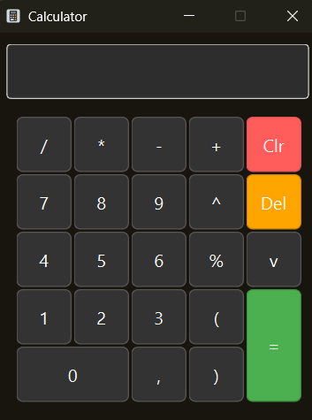

# Qt-calculator

[](https://wakatime.com/badge/user/aa09e045-9241-455f-a7ed-3b0b87d5fc64/project/3600eb42-a237-4108-b804-d01fba2406d7)

<p align="center"></p>
A simple calculator application built using the Qt framework. This application provides basic arithmetic operations such
as addition, subtraction, multiplication, and division.
<p align="center"></p>

## Features

- User-friendly interface
- Basic arithmetic operations
- Clear and reset functionality
- Terminal mode for quick calculations
- Error handling for invalid inputs

## Requirements

- Qt framework (version 6)
- C++ compiler
- CMake (for building the project)
- Qt Creator (optional, for development)
- Terminal (for terminal mode)
- Git (for cloning the repository)

## Usage

- Launch the application to open the calculator interface.
- Use the buttons to perform calculations.
- To clear the current input, use the "Clr" button on the interface.
- For terminal mode, run the application with the `--input` flag:
  ```bash
   ./qt-calculator --input "2 + 2"
   ```

- The result will be displayed in the terminal.

## Contributing

Contributions are welcome! Please fork the repository and create a pull request with your changes.

## Acknowledgments

- Built using the Qt framework.
- Inspired by the need for a simple and effective calculator application.
- Thanks to the open-source community for their support and contributions.
- Special thanks to Danil Losev for creating and maintaining this project.
- Icons made by icons8 from www.icons8.com

## Contact

For any questions or suggestions, please contact Danil Losev at

- Email: dlosevdan@gmail.com
- GitHub: [Danil-Losev](https://github.com/Danil-Losev/)

Enjoy using Qt-calculator!
